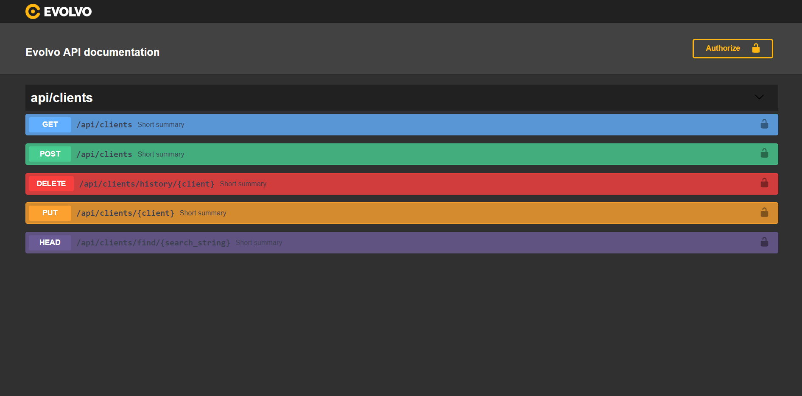

# Swagger 5.7 comments generator

## About
The `swagger-doc-generators` package allows you to create comments from validation classes for swagger documentation.


## Installation
Require the `evolvo/swagger-doc-generators` package in your `composer.json` and update your dependencies:
```sh
$ composer require evolvo/swagger-doc-generators
```

add 
```sh
Evolvo\SwaggerDocGenerators\SwaggerDocGeneratorsServiceProvider::class
```
to config/app.php 'providers' array


## Usage
Run `php artisan comment {METHOD::route}` to generate comment for route. You can specify multiple routes.

Run `php artisan comment:controller {controller}` to generate comments for whole controller.


## Examples
For single route
`php artisan comment GET::api/clients`

For multiple routes
`php artisan comment GET::api/clients POST::api/clients PUT::api/clients/{client}`

For controller
`php artisan comment:controller ClientsController`


## Custom documentation style
Run `swagger-custom-style:apply` to apply custom style.
After that go to `config/l5-swagger.php` and change style in `css` array.

Example


Run `swagger-custom-style:remove` to remove custom style.


